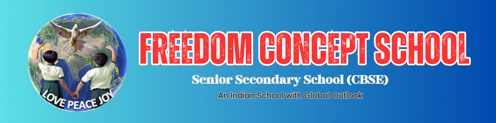

**Location:** Peace Ville, NH-46, Chennai-Bangalore Highway, Poigai-Sathyamangalam, Vellore, Tamil Nadu – 632114.  
**School Type:** Co-educational, English Medium, Private, Non-residential.  
**Years of Education:** 2010 - 2022 
 

## 🎓 10th Standard (2019-2020)
I completed my 10th standard at Freedom Concept School, where I built a strong foundation in Mathematics, Science, Social Studies, and English. During this period, I developed critical thinking and problem-solving skills, which helped me approach challenges with a logical mindset. I actively participated in school events, quizzes, and science projects, which enhanced my creativity and teamwork. This phase also taught me discipline, time management, and leadership qualities. Overall, my 10th standard experience helped me grow academically and personally, preparing me for higher studies.

## 🎓 12th Standard (2021-2022)
For my 12th standard, I chose the Commerce stream with Computer Science, which allowed me to combine analytical, technical, and business skills. I gained hands-on knowledge in Python programming, Database management (SQL), and basic Data Structures & Algorithms, which gave me a strong foundation in coding and problem-solving. Alongside technical skills, I studied accounting, economics, and business studies, developing a clear understanding of commerce concepts. I also worked on small projects and practical assignments, which strengthened my logical thinking and application abilities. This combination of commerce and computer science prepared me for higher education and future career opportunities in both business and technology.

## 📚 Curriculum & Learning Approach
- Follows CBSE curriculum with NCERT guidelines.  
- Focus on concept-based learning to help students realize their potential.  
- Modern teaching methods with technology integration.

## 🌟 Mission & Vision
- Provide quality education to first-generation learners and students from rural backgrounds.  
- Create an environment for students to learn along with natural and greenery landscapes.
- Provides excellent facilities and learning at a reasonable fee. 
 
